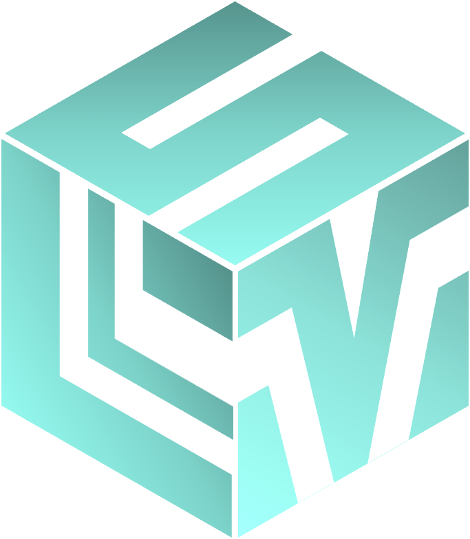

<!DOCTYPE html>
<html>
<head>
	<meta charset="utf-8">
    <meta name="viewport" content="width=device-width, initial-scale=1, shrink-to-fit=no">
    <link rel="stylesheet" href="style.css">
	<link rel="stylesheet" href="bootstrap.css">
	<title>Aprende LSV</title>
</head>
<body>
	

		<!----------------------------------------barra azul-------------------------------------------------->
		

         	
Niveles

         
 
         <!----------------------------------------header principal------------------------------------------->
		<header class="center">
				
				
Bienvenida/o!

		</header>
		<!----------------------------------------contenido-------------------------------------------------->
		

            

            <a href="Nivel_1.html" class=" boton-nivel">
            	<button type="button" name="button" class="btn btn-info boton-nivel fondo_azul"> 
         			<h4>Nivel 1</h4>
            	</button>
            </a>
            

            

            	<button type="button" name="button" class="btn btn-light boton-nivel fondo_blanco">
0
</button>
            

            

            	<button type="button" name="button" class="btn btn-light boton-nivel fondo_blanco">
0
</button>
            

            

            	<button type="button" name="button" class="btn btn-light boton-nivel fondo_blanco">
0
</button>
            

            

            	<button type="button" name="button" class="btn btn-light boton-nivel fondo_blanco">
0
</button>
            

          

          <!----------------------------------------navegacion-------------------------------------------------->
         

         	

	            

		            <a href="index.html" class=" icono_menu_ppal">
                          
		         		<h5>Lecciones</h5>
		            </a>
	            

	            

		            <a href="#busqueda.html" class=" icono_menu_ppal">
                          
		         		<h5>Busqueda</h5>
		            </a>
	            
 
	            

		            <a href="#configuracion.html" class=" icono_menu_ppal">
                          
		         		<h5>Configuración</h5>
		            </a>
	            
  
          	

         
 
	

</body>
</html>
